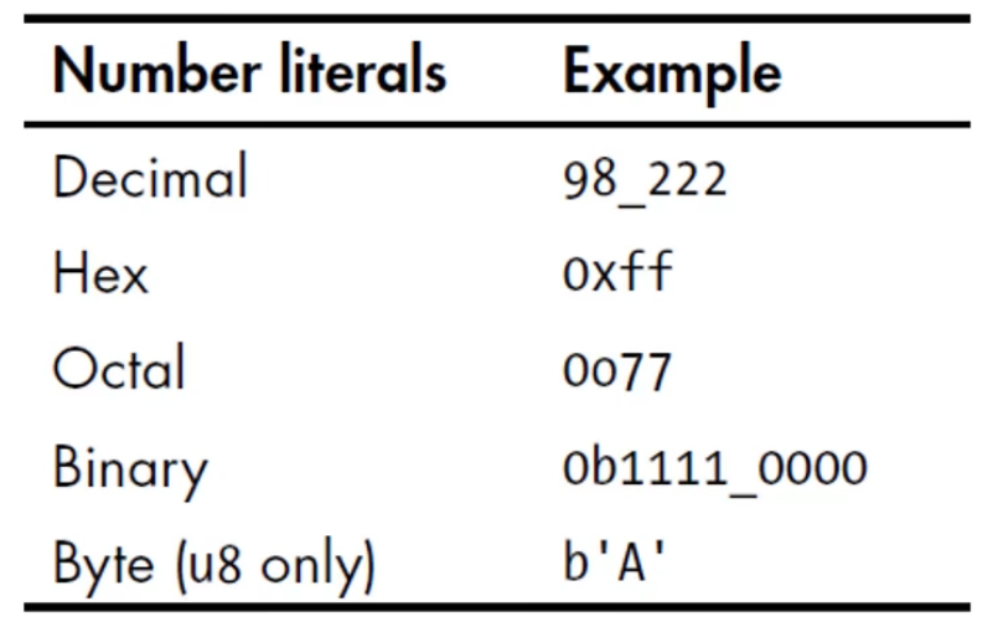
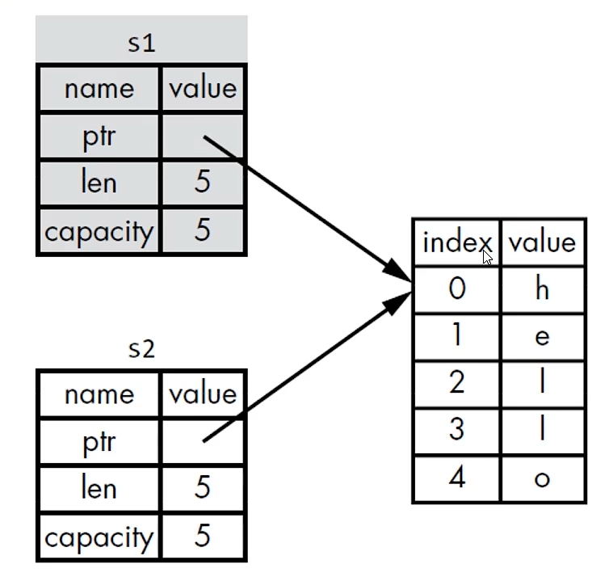
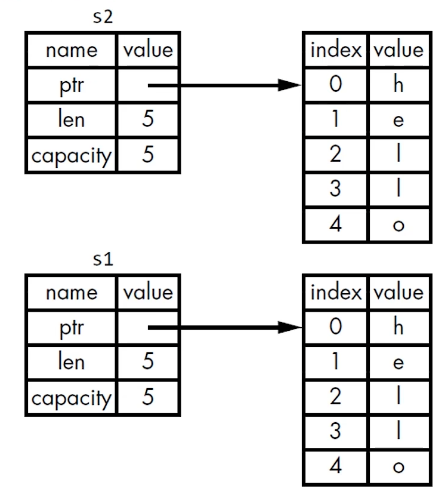
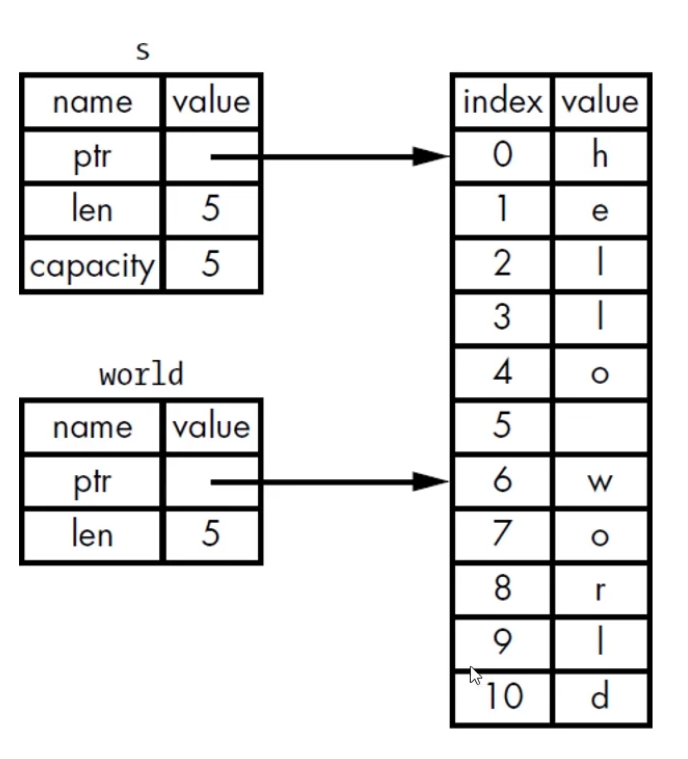

## basic

使用 rustc 编译 .rs 后缀文件

- 在windows 中生成 .exe .pdb(调试文件)

`fn` 定义函数

`*!` 表示 rust macro （rust 宏）（与函数不同）

tab 是4个空格


## cargo

`cargo new <name>`

- 生成 src

    - rs 源文件

- Cargo.toml

    - Tom's Obvious, Minimal Language

    - 是 cargo 的配置格式

    - [package] 配置包

    - [dependencies] 依赖项（在 rust 中，代码包被称为 crate）

- 顶层目录放源码无关文件

`cargo build`

- 自动生成 target 文件夹

    - debug 目录下放可执行文件

- 自动生成 Cargo.lock 文件夹

    - 第一次 build 时生成

    - 用于精确版本控制，不手动修改

`cargo run`

- build 并 执行（源码未更改则直接执行）

`cargo check`

- 检查

`cargo build --release`

- 会进行优化，时间长

- 位于 target/release

`cargo update`

-   忽略 .lock 文件，寻找合适的包，保持小版本号 0.1.xxx
-   不会修改 .toml 文件


## guess num


crates.io

- 库的网址


添加包

手动在 Cargo.toml 中添加

```toml
[dependencies]
rand  = "^0.3.14" # 0.3.14 及以上
```


`loop{}`

-   循环
-   `break;` 跳出循环


## 基础语法

### 变量

`let x;`

-   默认不可变
-   需要使用 `mut` 声明可变


### 常量

`const MAX_POINT: i32 = 10_000;`

-   常量不可变，不能使用 `mut`
-   常量必须声明类型
-   可以绑定到常量表达式
-   不能绑定到函数执行结果 或 只有在运行时才能算出的值
-   在程序运行期间，在作用域内一直有效


### Shadowing

```rust
let x = 1;
let x = "456";	// 后声明的x把前面的shadow了，类型可变
```


### 注释

c 风格

```rust
// 
/* */
```


## 数据类型基础

### 标量类型

就四种，单个的类型

**整数类型**

-   u 符号 $[0, 2^n-1]$
-   i 无符号 $[-2^{n-1}, 2^{n-1}-1]$
-   8 16 32 64 128 size(依据系统)
-   默认类型 i32


**整数字面值**



-   除 byte 外，均允许使用类型后缀，如`57u8`


**整数溢出**

-   debug 模式，在运行时会 panic
-   release 模式，不会 panic， 会 256 变 0（“环绕”操作）


**浮点类型**

-   f32 单精度
-   f64 双精度 默认类型

-   IEEE 754 标准


**数值操作**

`+ - * / %`


**布尔类型**

-   true
-   false
-   占用一个字节


**字符类型**

-   `char`
-   使用单引号
-   占用四字节
-   使用 Unicode
-   范围 $[U+0000, U+D7FF] \ [U+E000, U+10FFFF]$


### 复合类型

**Tuple 元组**

-   长度固定，声明之后无法修改长度
-   `let tup: (i32, f64, u8) = (1, 1.0, 5);`
-   可以有多个类型

可以使用模式匹配解构

-   `let (x, y, z) = tup;`

访问 tuple 元素

-   `tup.0 tup.1 tup.2`


**数组**

-   长度固定
-   `let a: [i32; 3] = [1, 2, 3];`
-   数据存储在栈上，而不是堆上，更适合于保证固定数量的元素

特殊声明

-   每个元素都相同：`let a: [3; 5];` 相当于 `let a = [3,3,3,3,3]`

访问

-   数组是 stack 上单个块的内存
-   索引：`a[0]`
-   访问索引超出范围：编译通过，运行时报错 panic，不允许访问相应内存


## 函数

`fn`

-   全小写，下划线分隔

-   无先后定义顺序，不关心声明前后位置


**函数参数**

-   parameters 定义时 形参
    -   需要声明类型
-   arguments 调用时 实参


**表达式 (expression) 与语句 (statement)**

Rust 中 语句没有返回值

```rust
let y = {
	let x=1;
    x+3	// ; 这里加上;就不行了，会返回 ()
}; // 合法的，返回4
```


**函数返回值**

-   使用 `->` 表明返回类型，不能为返回值命名

-   默认返回最后一个表达式的值

    ```rust
    fn five() -> i32{
        5 // 注意这里没有 ;
    }
    ```

-   提前返回使用 `return`


## 控制流

### if

-   if 后必须跟 bool 类型，不会自动转换
-   与条件相关联的代码块叫做 分支(arm)

```rust
let number = 5;

if number < 5 {
	// 12321
} else {
	// 123213212
}
```

-   if 是表达式，可以放在等号右边

```rust
let a = true;

let num = if a {5} else {6};
// num 被记为 5
// if 与 else 后的块的返回表达式必须有兼容的类型
```


### loop

```rust
loop {
    // balabala
    // break;
}
```

-   loop 作为表达式，可以输出结果

```rust
let times = 0;

let result = loop{
	times += 1;
    
    if times == 10{
        break times * 2;	// 返回值在此
    }
}
```


### while

```rust
while true {
    // 121321
    
}
```


### for

-   用于遍历集合，安全又快

```rust
let a = [10, 20, 30, 40, 50];
for element in a.iter() {	// iter() 方法
 	println!("{}", element);
}
```


### range

-   开始数字与结束数字，左闭右开
-   rev 方法反转 range

```rust
for num in 0..4 {	// 左闭右开
    println!("{}!", num);
}

for num in 0..=4 {	// 左闭右闭
    println!("{}!", num);
}

for num in (0..4).rev() {	// 反转
    println!("{}!", num);
}
```


## 所有权

在编译时进行检查，运行时无额外开销

### stack + heap

**存储数据**

stack

-   后入先出
-   必须有已知+固定的大小
-   指针可以放在 stack 上

heap

-   放入heap 的数据会请求一定数量空间，返回指针
-   分配

**访问数据**

heap 要慢于 stack

stack 数据排列比较紧密，heap 比较稀疏

**函数调用**

压入 stack

### 所有权解决问题

跟踪代码哪些部分正在使用 heap 的哪些数据

最小化 heap 重复数据

清理 heap 上未使用的数据以防止空间不足

-   目标是管理 heap 数据


### 所有权规则

-   每个值都有一个变量，该变量为该值的所有者
-   每个值同时只有一个所有者
-   所有者超出 作用域 (scope) 时，值被删除

### 变量作用域 scope

是一致的概念

可以用 `{     }` 划分作用域

### String 为例

在 heap 上分配空间

`let s = String::from("hello"); // 从字符串字面值生成字符串变量`

-   s 可修改
-   字符串字面值无法修改
-   调用 from 函数时，申请了内存；需要一次释放
-   超出作用域后，会自动释放，调用 `drop` 函数


### 变量与数据交互 Move

仅对 stack 上的数据进行了拷贝，没有动 heap 上的数据

`s1` 被废弃，无法使用，`s2` 获得 `s1` 在 heap 中的数据

```rust
let s1 = String::from("Hello");
let s2 = s1;
```




### 变量与数据交互 Clone

对 stack 与 heap 上的数据都进行了拷贝

```rust
let s1 = String::from("Hello");
let s2 = s1.clone();
```



### Stack 上的数据 复制

大小已经确定，全部放在 stack 上，无需考虑 Heap

```rust
let x = 5;
let y = x; // 等同于 let y = x.clone();
```

实际上是实现了 copy trait

-   如果实现了 copy trait，则旧变量在赋值后仍然可以使用
-   如果类型或类型的一部分实现了 drop trait，则不允许实现 copy trait
-   默认实现 copy 的：
    -   简单标量组合
    -   整型、bool、char、浮点、所有字段都实现 copy 的 tuple
-   不可实现 copy的：
    -   任何需要分配内存/某种资源的


### 所有权与函数

调用函数时，相当于赋值，会出现 移动 或 复制

### 返回值与作用域

函数返回时会发生所有权转移

-   把一个值赋给其他变量时会发生移动
-   当一个包含 heap 数据的变量离开作用域时，他的值会被 drop 清理，除非他的所有权被转移到了另一个变量

### 函数使用某个值 并且 保留所有权

憨批解，正解是 借用

```rust
fn main (){
	let s1 = String::from("Hello")
	let (s2, len) = cal(s1);    
    println!("{}", s2);
}

fn cal(s: String) -> (String, usize){
 	let length = s.len();
    (s, length)
}

```


### 引用

`&`

-   引用某些值，但不获得所有权
-   默认为不可变，需要添加 `mut` 声明可变
-   注：要通过引用改变变量需要：1.变量可变 2.引用可变
-   **在一个作用域里 只能 有一个可变引用**
-   **不可以同时拥有可变引用与不可变引用**
    -   理解有误，应该是不可以在存在不可变引用的情况下尝试修改可变引用

-   **可以同时多个不可变引用**

借用

-   使用引用作为参数类型

-   参数类型是 `&String`

```rust
fn main (){
	let s1 = String::from("Hello")
	let len = cal(&s1);    
    println!("{}", s1);
}

fn cal(s: &String) -> usize{
	s.len()	
}	// 由于没有所有权，所以不会清除数据
```


### 悬空引用 

Dangling Pointer

-   指针引用的地址已经被别人用了

-   rust 编译器会保证不会出现该情况，如

```rust
fn ccc() -> &String{
    let s = String::from("123");
    &s
}	// 是编译过不了的
```


### 切片

slice

-   不持有所有权的数据类型

**字符串切片**



```rust
let mut s = String::from("Hello word")

let word = &s[0..5]; // 某个变量的引用 [] // 左闭右开
```

-   语法糖*3
    -   `&s[..5]` 从开头
    -   `&s[5..]` 到末尾
    -   `&s[..]` 全部

-   字符串的切片索引必须在有效的 UTF-8 字符边界，否则报错
-   字符串切片默认是不可变的 （不知道是否可以可变）
-   字符串字面值实际上是 字符串切片

**字符串切片作为参数传递**

实际上是使用字符串切片代替字符串引用

若传入的是字符串引用的话，会自动生成字符串切片

```rust
fn first_word(s: &String) -> &str 

fn first_word(s: &str) -> &str
```

**其他类型切片**

```rust
let a = [1,2,3,4,5];

let slice = &a[1..3];	// 数组切片，stack 中存储指针+
```


## Struct

### Struct 基础

```rust
// 定义
struct User{
    username: String,
    email: String,
    active: bool,
}

// 实例化
// 顺序可以打乱
// 必须对全部字段赋值
// struct 可变则全部字段可变
let user1 = User{
    email: String::from("asd@sjtu.edu.cn"),
    username: String::from("fg"),
    active: true,
};

// 取字段
user1.email // balabala

// 字段初始化简写
// 字段名与参数名相同
fn build_user(email: String, username: String)->User{
    User{
 		email,
        username,
        active: true;
    }
}

// struct 更新语法
// 基于一个 struct 创建新的 struct
let user2 = User{
    email: String::from("123@sjtu.edu.cn"),
    username: String::from("123"),
    ..user1	// 与user1有相同的值
};

// tuple struct
// 整体有名，字段没名
// 给整个 tuple 起名使不同于其他 tuple
struct Color(i32, u32, i32)

// Unit-Like Struct
// 没有任何字段的Struct
// 适用于在某个类型上实现 trait，但是在里头没有想要存储的数据

```

### Struct 的所有权

-   本例中 User 的字段使用的是 String 类型，struct 拥有全部的所有权，只要 struct 有效，字段就有效
-   若使用 &str，则需要使用生命周期（lifetime），以保证在 struct 有效的时候，里头的引用也是有效的


### Struct 与 println!

需要实现 `std::fmt::Display` 以直接放入 `println!` 的占位符中输出

但是 rust 提供了一些 macro 输出调试信息 `std::fmt::Debug`

-   现在 struct 定义前加上 `#[derive(Debug)]`
-   然后有两种占位符输出：`{:?}` `{:#?}`


### Struct 方法

方法

-   与函数类似：fn 关键字、名称、参数、返回值
-   不同：
    -   在 struct、enum、trait 对象的上下文定义
    -   第一个参数是 self，无需传这个参数，self 可以是借用，也可以获得所有权，甚至可变
-   调用 
    -   `实例.方法名()`
    -   **会自动引用或解引用**

```rust
struct Rectangle {
    width: u32,
    length: u32,
}

impl Rectangle{
    fn area (&self) -> u32{
        self.width * self.length
    }
}

fn main() {
    let rect = Rectangle{
        width: 30,
        length: 50,
    };
    println!("{}", rect.area());
}
```


### Struct 关联函数

是函数，不是方法，第一个参数不是 self 相关

-   例如：String::from()
-   常用与构造器

```rust
impl Rectangle{
    fn square (size: u32) -> Rectangle{
        Rectangle {
            width: size,
            width: size,
        }
    }
}

```


`::` 用于

-   关联函数
-   模块创建的命名


## 枚举

### 基本操作

```rust
// 定义
enum IpAddrkind {
    V4,
    V6,
}


// 创建，使用命名空间
// 可以定义函数返回枚举类型
let four = IpAddrKind::V4;

```


### 将数据附加到枚举的变体中

```rust
// 无需额外使用 struct
enum IpAddr {
    V4(String),
    V6(String),
}

// 每个变体可以有不同的类型与关联的数据量
enum IpAddr {
    V4(u8.u8.u8.u8),
    V6(String),
}

let home = IpAddr:;V4(127.0.0.1);
let loopback  = IpAddr::V6(String::from("::1"));
```


### 为枚举定义方法

```rust
enum Message {
    Quit,
    Move {x: i32, y: i32}, // 匿名结构体
    Write(String),
    ChangeColor(i32, i32, i32),
}

impl Message{
 	fn call(&self){
        
    }
}
```


### Option 枚举

定义在标准库中，在 Prelude 模块中（预导入）

可能存在的值，用来代替 Null 

```rust
enunm Option<T> {
	Some(T),
	None,
}
```

使用

```rust
let s1 = Some(5);
let s2 = Some("A Stering");

let s3: Option<i32> = None;
```

不可以将 Option 与 常规的值进行直接运算

需要先手动转换（同时进行了空值处理）


### 控制流运算符 Match

基础用法

```rust
enum Coin{
    Pp,
    Tt,
    Cc,
}

fn convert(coin: Coin) -> u8 {
    match coin{
        Coin::Pp=>1,	// 对应多行代码需要使用花括号
        Coin::Tt=>2,
        Coin::Cc=>3,
    }
}
```

绑定值的模式匹配

```rust
#[derive(Debug)]
enum Typ{
    Abc,
    Bcd,
}

enum Coin{
    Pp,
    Tt,
    Cc(Typ),
}

fn convert(coin: Coin) -> u8 {
    match coin{
        Coin::Pp=>1,
        Coin::Tt=>2,
        Coin::Cc(t)=>{	// 在这里进行值的绑定
        	println!("{:?}", t);
            3
        },
    }
}
```


注：match 必须穷举所有可能

可以使用 `_` 作为其他情况的通配符


### 简单的控制流 if let 

只关心一种匹配

```rust
let v = Some(0u8);

if let Some(3) = v {	// 注意这里是一个 =（而非两个）
    println!("three");
} else {
  	println!("others");  
};
```

